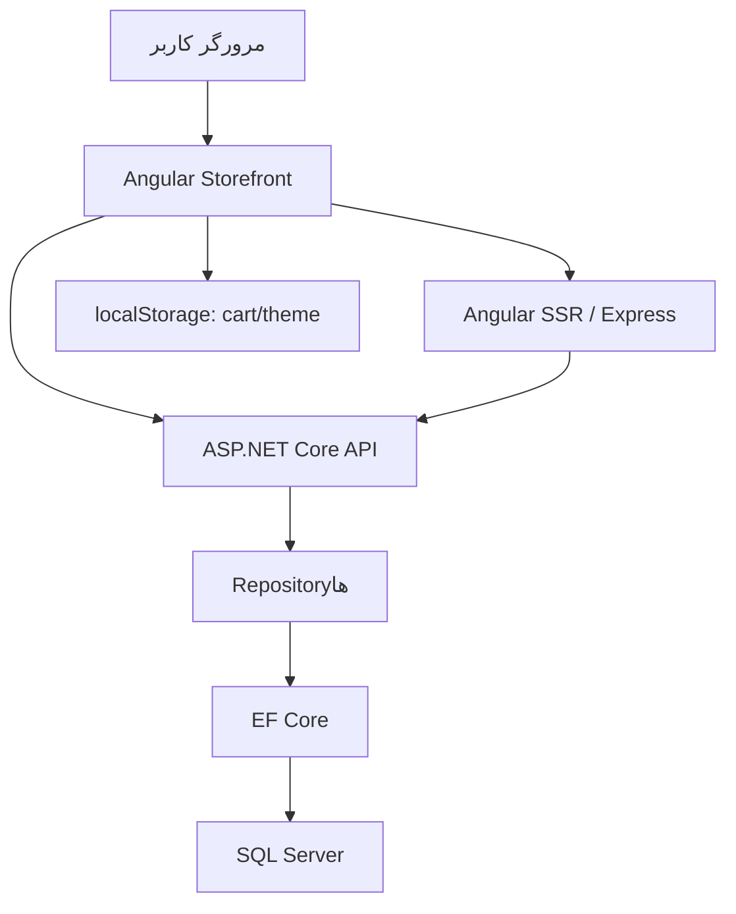
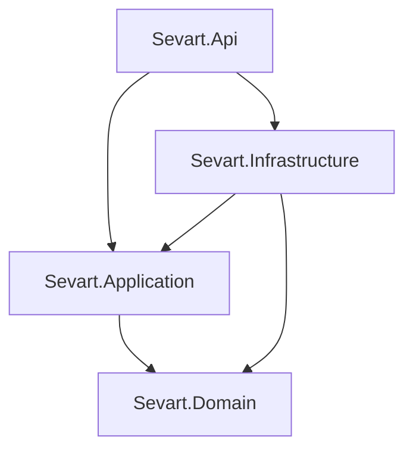

# معماری فنی پروژه Sevart

## هدف سند

این سند معماری موجود در Snapshot فعلی مخزن را توصیف می‌کند. موارد پیاده‌سازی‌شده از جهت‌گیری هدف و بدهی‌های فنی جدا شده‌اند تا مستندات، وضعیتی جلوتر از کد را نمایش ندهند.

## نمای کلی مخزن

| مسیر | مسئولیت |
| --- | --- |
| `shop-client/` | برنامهٔ Angular شامل Storefront، پنل مدیریت و SSR |
| `shop-server/` | Backend مبتنی بر ASP.NET Core Web API، EF Core و SQL Server |
| `docs/` | مستندات پروژه، معماری، UI و Roadmap |
| `AGENTS.md` | قواعد مشارکت و توسعه در مخزن |

Frontend و Backend در یک مخزن قرار دارند، اما Build و اجرای مستقلی دارند. قرارداد اتصال آن‌ها HTTP/JSON و مسیر پایهٔ `/api` است.

## معماری سطح بالا

جریان اصلی Storefront:

در وضعیت فعلی همهٔ صفحات از یک منبع داده استفاده نمی‌کنند. بخشی از Storefront و Admin به API متصل شده‌اند و برخی صفحات هنوز از Mock Data استفاده می‌کنند.

## Frontend

### فناوری‌ها

- Angular `22.0.x`
- Standalone Components
- Angular Signals و RxJS
- Reactive Forms
- Angular Material و CDK
- Angular SSR با Express
- SCSS و Tailwind CSS
- Vitest برای تست واحد

### نقاط ورود و پیکربندی

| فایل | مسئولیت |
| --- | --- |
| `shop-client/src/main.ts` | Bootstrap مرورگر |
| `shop-client/src/main.server.ts` | Bootstrap سمت سرور |
| `shop-client/src/server.ts` | سرور Express و Angular Node App Engine |
| `shop-client/src/app/app.config.ts` | Router، HttpClient، Hydration و Error Listenerها |
| `shop-client/src/app/app.config.server.ts` | Server Rendering Providerها |
| `shop-client/src/app/app.routes.ts` | Routeهای برنامه |
| `shop-client/src/app/app.routes.server.ts` | Render Modeها و پارامترهای Prerender |
| `shop-client/src/environments/` | URL سرویس‌ها برای Development و Production |

`provideHttpClient()` در پیکربندی اصلی ثبت شده و `provideClientHydration()` برای Hydration خروجی SSR فعال است.

### ساختار `src/app`

| مسیر | مسئولیت فعلی |
| --- | --- |
| `admin/` | Layout، Routeها، صفحات و سرویس‌های پنل مدیریت |
| `core/models/` | مدل‌های Category، Product، Product Option و Cart Item |
| `core/mock-data/` | داده‌های Mock باقی‌مانده برای محصولات و Prerender |
| `core/services/` | سرویس‌های Category، Product، Cart، SEO و Theme |
| `layout/` | Header، Footer و Main Layout فروشگاه |
| `pages/` | صفحات Storefront، Checkout و Auth |
| `shared/components/` | اجزای مشترک عمومی مانند Confirm Dialog |
| `shared/ui/` | اجزای UI قابل‌استفادهٔ مجدد مانند Product Card |

### الگوی کامپوننت‌ها و State

- کامپوننت‌ها Standalone هستند و dependencyهای قالب را در `imports` خود تعریف می‌کنند.
- سرویس‌ها و dependencyها عمدتاً با `inject()` دریافت می‌شوند.
- State محلی و مشتق‌شده با `signal()` و `computed()` نگهداری می‌شود.
- Observableهای HTTP در برخی صفحات با `toSignal()` به Signal تبدیل می‌شوند و در برخی نقاط با `subscribe()` مصرف می‌شوند.
- قالب‌ها از Control Flow جدید Angular مانند `@if` و `@for` استفاده می‌کنند.
- صفحات Auth و Checkout از Reactive Forms استفاده می‌کنند.

### Routing فروشگاه

Storefront زیر `MainLayout` اجرا می‌شود:

| مسیر | صفحه | وضعیت داده |
| --- | --- | --- |
| `/` | Home | دسته‌بندی از API، محصولات منتخب از Mock |
| `/products` | Products | محصولات و جست‌وجوی محلی از Mock |
| `/categories/:slug` | CategoryProducts | API |
| `/products/:id` | ProductDetail | مقدار `id` عملاً Slug است و محصول از API دریافت می‌شود |
| `/cart` | Cart | Local State و `localStorage` |
| `/checkout` | Checkout | فرم محلی و غیرمتصل به Order API |
| `/login` | Login | Lazy-loaded و نمایشی |
| `/register` | Register | Lazy-loaded و نمایشی |
| `/forgot-password` | ForgotPassword | Lazy-loaded و نمایشی |
| `/reset-password` | ResetPassword | Lazy-loaded و نمایشی |

Route ناشناخته به صفحهٔ خانه Redirect می‌شود. صفحهٔ 404 مستقل در وضعیت فعلی وجود ندارد.

### Routing پنل مدیریت

مسیر `/admin` با `loadChildren` بارگذاری می‌شود و `AdminLayout` را به‌عنوان پوستهٔ مشترک دارد.

| مسیر | مسئولیت |
| --- | --- |
| `/admin` | Dashboard اولیه |
| `/admin/categories` | فهرست دسته‌بندی‌ها |
| `/admin/categories/create` | ایجاد دسته‌بندی |
| `/admin/categories/:id` | ویرایش دسته‌بندی |
| `/admin/products` | فهرست محصولات |
| `/admin/products/create` | ایجاد محصول |
| `/admin/products/:id` | ویرایش محصول |

صفحات فرزند Admin با `loadComponent` بارگذاری می‌شوند. Guard، Authentication و Role-based Authorization هنوز پیاده‌سازی نشده‌اند.

### لایهٔ دسترسی به API

سرویس‌های عمومی:

| سرویس | مسئولیت |
| --- | --- |
| `CategoryService` | دریافت دسته‌بندی‌ها، دسته‌بندی بر اساس Slug و دسته‌بندی همراه محصولات |
| `ProductService` | دریافت محصول بر اساس Slug و محصولات منتشرشدهٔ یک دسته‌بندی |

سرویس‌های Admin:

| سرویس | مسئولیت |
| --- | --- |
| `AdminCategoryService` | CRUD و فعال/غیرفعال‌سازی Category |
| `AdminProductService` | CRUD و انتشار/آرشیو Product |
| `AdminProductOptionDefinitionService` | دریافت و مدیریت Definitionهای گزینه |

URL پایه از Environment خوانده می‌شود:

| محیط | URL فعلی |
| --- | --- |
| Development | `http://localhost:5090/api` |
| Production | `https://sevart.ir/api` |

### مدل‌های Frontend و Mapping

Frontend یک مدل داخلی `Product` دارد که برای UI و Cart استفاده می‌شود. پاسخ عمومی API با `ProductResponse` دریافت و در صفحهٔ جزئیات به مدل داخلی Map می‌شود.

این جداسازی مفید است، اما Mapping فعلی کامل نیست:

- API عمومی `CategoryName` برنمی‌گرداند و مقدار آن در مدل UI خالی قرار می‌گیرد.
- وضعیت `isAvailable` برای پاسخ عمومی به‌صورت `true` در نظر گرفته می‌شود.
- Route با نام پارامتر `id` تعریف شده، اما مقدار واقعی آن Slug محصول است.

این موارد قرارداد فعلی هستند و هنگام یکپارچه‌سازی نهایی API و Frontend باید بازبینی شوند.

### جریان Product Option

1. API گزینه‌های فعال محصول و مقادیر فعال آن‌ها را برمی‌گرداند.
2. صفحهٔ Product Detail گزینه‌ها را بر اساس `DisplayOrder` مرتب می‌کند.
3. UI بر اساس `ProductOptionInputType` کنترل Select، Radio یا Color نمایش می‌دهد.
4. گزینه‌های Required پیش از افزودن به Cart اعتبارسنجی می‌شوند.
5. قیمت نهایی از قیمت پایه و مجموع `PriceAdjustment` انتخاب‌ها ساخته می‌شود.
6. انتخاب‌ها به مدل `SelectedCartOption` تبدیل و همراه Cart Item ذخیره می‌شوند.

### جریان سبد خرید

`CartService` منبع State سبد در Frontend است:

- State با `signal<CartItem[]>` نگهداری می‌شود.
- `totalItems` و `totalPrice` با `computed()` محاسبه می‌شوند.
- Persistence با کلید `shop-cart` در `localStorage` انجام می‌شود.
- دسترسی به Storage با `isPlatformBrowser()` محافظت می‌شود.
- `cartItemId` از شناسهٔ محصول و ترکیب مرتب‌شدهٔ Option/Valueها ساخته می‌شود.
- یک Product با ترکیب گزینه‌های متفاوت، ردیف‌های مستقل Cart ایجاد می‌کند.
- دادهٔ قدیمی Storage هنگام بارگذاری تا حد اولیه اعتبارسنجی و Normalize می‌شود.

قیمت ذخیره‌شده در مرورگر قابل‌اعتماد نیست. هنگام پیاده‌سازی Checkout واقعی، Backend باید قیمت محصول و گزینه‌ها را دوباره از Database محاسبه کند.

### Theme و SEO

- Theme روشن و تیره با `data-theme` روی عنصر `<html>` مدیریت می‌شود.
- انتخاب Theme با کلید `shop-theme` در `localStorage` ذخیره می‌شود.
- SEO Service عنوان، Description، Open Graph و Canonical Link را به‌روزرسانی می‌کند.
- URL پایهٔ Canonical در صفحات فعلی به‌صورت ثابت `https://sevart.ir` تعریف شده است.

### SSR و Prerender

Angular با `outputMode: "server"` ساخته می‌شود. سرور Express فایل‌های استاتیک Browser Build را سرو می‌کند و درخواست‌های دیگر را به Angular Node Engine می‌فرستد.

Render Modeهای فعلی:

| الگوی مسیر | Render Mode | منبع پارامتر |
| --- | --- | --- |
| `products/:id` | Prerender | `MOCK_PRODUCTS` |
| `categories/:slug` | Prerender | `MOCK_CATEGORIES` فعال |
| `admin/**` | Client | ندارد |
| `**` | Prerender | Routeهای ثابت |

صفحات Category و Product Detail هنگام اجرا به API درخواست می‌زنند، درحالی‌که پارامترهای مسیر Prerender از Mock تولید می‌شوند. بنابراین دو وابستگی جدا وجود دارد:

- لیست Routeهای قابل‌ساخت از Mock Data می‌آید.
- دادهٔ صفحه هنگام Prerender ممکن است از API دریافت شود.

اگر API Development هنگام Build در دسترس نباشد، Prerender صفحات متصل به API می‌تواند شکست بخورد. این وضعیت نیازمند تصمیم معماری دربارهٔ Static Prerender، Runtime SSR یا Client Rendering است.

## Backend

### فناوری‌ها و Solution

Backend با .NET `10.0` ساخته شده و Solution آن در `shop-server/Sevart.slnx` قرار دارد.

پروژه‌ها:

| پروژه | مسئولیت فعلی |
| --- | --- |
| `Sevart.Domain` | Entityها، Enumها، قواعد و رفتارهای Domain |
| `Sevart.Application` | Repository Interfaceها |
| `Sevart.Infrastructure` | EF Core، SQL Server، Repositoryها و Migrationها |
| `Sevart.Api` | Controllerها، HTTP Contractها، DI، CORS و OpenAPI |

### جهت وابستگی‌ها

Project Referenceهای فعلی:

`Sevart.Domain` هیچ Project Reference ندارد. بنابراین جهت وابستگی فنی لایه‌ها با اصول پایهٔ Clean Architecture سازگار است.

### وضعیت واقعی Application Layer

Application در وضعیت فعلی فقط Interfaceهای زیر را نگهداری می‌کند:

- `ICategoryRepository`
- `IProductRepository`
- `IProductOptionDefinitionRepository`

Use Case، Command/Query، Handler یا Application Service هنوز وجود ندارد. در نتیجه orchestration عملیات Create و Update، اعتبارسنجی وابستگی‌ها و Mapping پاسخ‌ها عمدتاً داخل API Controllerها انجام می‌شود.

معماری هدف این است که:

- قواعد و invariantهای کسب‌وکار در Domain باقی بمانند.
- orchestration و Use Caseها به Application منتقل شوند.
- Controllerها فقط HTTP concerns، فراخوانی Use Case و تبدیل نتیجه به Response را مدیریت کنند.

این انتقال هنوز انجام نشده و باید به‌صورت مرحله‌ای و بدون abstraction زودهنگام انجام شود.

### Domain Layer

ساختار اصلی:

| بخش | اعضای فعلی |
| --- | --- |
| Common | `BaseEntity`, `BaseAuditableEntity` |
| Entities | `Category`, `Product`, `ProductImage`, `ProductOptionDefinition`, `ProductOption`, `ProductOptionValue` |
| Enums | `ProductStatus`, `ProductOptionInputType` |

رفتارهای مهم Domain:

- اعتبارسنجی داده‌های پایه در Constructor و Updateها
- انتشار و آرشیو Product
- فعال و غیرفعال‌کردن Category و Option Definition
- افزودن، حذف و انتخاب تصویر اصلی Product
- افزودن Definition به Product به‌عنوان Product Option
- مدیریت مقادیر Option و وضعیت فعال آن‌ها
- جلوگیری از ثبت چندبارهٔ یک Option Definition روی یک Product

Collectionهای Product به‌صورت داخلی mutable و در بیرون به شکل `IReadOnlyCollection` ارائه می‌شوند.

### Persistence و EF Core

`SevartDbContext` DbSetهای زیر را ثبت می‌کند:

- Categories
- Products
- ProductImages
- ProductOptionDefinitions
- ProductOptions
- ProductOptionValues

Configurationها با `ApplyConfigurationsFromAssembly()` بارگذاری می‌شوند. `SaveChangesAsync()` مقادیر `CreatedAt` و `UpdatedAt` موجودیت‌های Auditable را بر اساس `DateTime.UtcNow` تنظیم می‌کند.

Relationshipهای اصلی:

| رابطه | Delete Behavior |
| --- | --- |
| Category → Products | Restrict |
| Product → Images | Cascade |
| Product → Options | Cascade |
| ProductOptionDefinition → ProductOptions | Restrict |
| ProductOption → Values | Cascade |

Precision قیمت Product و `PriceAdjustment` برابر `(18, 2)` است. در وضعیت فعلی فقط Slug مربوط به `ProductOptionDefinition` دارای Unique Index صریح است؛ Unique بودن Slug دسته‌بندی و محصول در Configuration فعلی اعمال نشده است.

Migrationهای موجود:

- `InitialCreate`
- `AddProductOptionDefinitions`
- `LinkProductOptionToDefinition`

### Repositoryها

Infrastructure پیاده‌سازی Repositoryهای Category، Product و Product Option Definition را فراهم می‌کند. Repositoryها مسئول queryهای EF Core، بارگذاری graphهای لازم و ذخیرهٔ تغییرات هستند.

Repositoryهای Infrastructure از Interfaceهای Application پیروی می‌کنند و در `Program.cs` با lifetime نوع Scoped ثبت شده‌اند.

### API Layer

API از Controller-based routing با الگوی `api/[controller]` استفاده می‌کند.

Controllerهای فعلی:

| Controller | مسئولیت |
| --- | --- |
| `CategoriesController` | CRUD، فعال/غیرفعال‌سازی و دریافت محصولات دسته |
| `ProductsController` | API عمومی و مدیریتی Product، تصاویر و گزینه‌ها |
| `ProductOptionDefinitionsController` | مدیریت Definitionهای گزینه |

HTTP Contractها در `Sevart.Api/Contracts/` و به تفکیک Feature نگهداری می‌شوند. پاسخ عمومی Product از پاسخ Admin جداست تا فیلدهای مدیریتی به Storefront نشت نکنند.

Mapping تصویر اصلی با اولویت زیر انجام می‌شود:

1. `IsPrimary` نزولی
2. `DisplayOrder` صعودی

در پاسخ عمومی Product:

- فقط Optionهای فعال برگردانده می‌شوند.
- فقط Valueهای فعال برگردانده می‌شوند.
- هر دو مجموعه با `DisplayOrder` مرتب می‌شوند.

### Pipeline و پیکربندی اجرا

`Program.cs` موارد زیر را پیکربندی می‌کند:

- SQL Server DbContext
- Repository Dependency Injection
- Controllers
- OpenAPI و Swagger در Development
- CORS برای Originهای Development فعلی
- HTTPS Redirection خارج از Development
- Authorization Middleware بدون Authentication واقعی

Connection String از `ConnectionStrings:DefaultConnection` خوانده می‌شود.

در کد فعلی `UseCors("AngularClient")` دو بار پشت سر هم فراخوانی شده است. این مورد رفتار معماری مطلوب نیست و در مرحلهٔ اصلاح کد باید به یک فراخوانی کاهش یابد؛ این سند فقط وضعیت را ثبت می‌کند.

## قراردادهای بین Frontend و Backend

### Category

Frontend انتظار فیلدهای زیر را دارد:

- `id`
- `name`
- `slug`
- `description`
- `imageUrl`
- `displayOrder`
- `isActive`

### Product عمومی

پاسخ عمومی شامل موارد زیر است:

- `id`
- `categoryId`
- `name`
- `slug`
- `description`
- `price`
- `imageUrl`
- `displayOrder`
- `options`

Option شامل Definition، عنوان، Input Type، Required بودن، ترتیب و Valueهای قابل‌انتخاب است.

### جداسازی عمومی و مدیریتی

- Endpointهای عمومی باید فقط Category فعال، Product منتشرشده و Option/Value فعال را نمایش دهند.
- Admin Response می‌تواند Status، همهٔ تصاویر و ساختار کامل گزینه‌ها را برای ویرایش برگرداند.
- Frontend نباید Enumهای عددی Backend را بدون قرارداد مشترک مستقل تغییر دهد.

## امنیت و مرز اعتماد

موارد فعلی:

- Authentication پیاده‌سازی نشده است.
- Admin Route و Admin API محافظت نشده‌اند.
- `UseAuthorization()` وجود دارد، اما بدون Authentication Scheme و Policy مؤثر نیست.
- CORS فقط Originهای محلی مشخص را مجاز می‌کند.
- Cart و قیمت نهایی در مرورگر نگهداری می‌شوند.

الزامات پیش از Production:

- Authentication و Role-based Authorization برای Admin و Customer
- محافظت Server-side از عملیات مدیریتی
- محاسبهٔ مجدد قیمت و گزینه‌ها در Backend هنگام Checkout
- Validation یکپارچهٔ Requestها
- Global Exception Handling و پاسخ خطای استاندارد
- Secret Management و Connection String امن
- CORS محیط‌محور
- Logging، Rate Limiting و Security Headerهای لازم

## محدودیت‌ها و بدهی‌های فنی فعلی

### اولویت بالا

- Application Layer فاقد Use Case است و Controllerها orchestration سنگین دارند.
- Admin UI و API هیچ Authentication/Authorization واقعی ندارند.
- SSR/Prerender به ترکیب Mock Route Params و API Runtime Data وابسته است.
- Order، Checkout سمت سرور و اعتبارسنجی قیمت پیاده‌سازی نشده‌اند.
- Slug محصول و دسته‌بندی Unique Constraint صریح ندارند.

### اولویت متوسط

- صفحهٔ همهٔ محصولات و محصولات منتخب Home هنوز Mock هستند.
- نام پارامتر Route جزئیات `id` است، اما مقدار آن Slug است.
- Mapping مدل API به مدل UI در صفحه انجام می‌شود و بعضی فیلدها مقدار جایگزین می‌گیرند.
- API فاقد قرارداد یکپارچهٔ Validation و Error Response است.
- CORS Middleware تکراری ثبت شده است.
- URL Canonical در چند صفحه تکرار و Hard-code شده است.

### قابلیت‌های هنوز مدل‌نشده

- Customer و Address
- Order و OrderItem Snapshot
- Payment
- Shipping
- Discount و Coupon
- مدیریت فایل و تصویر
- Monitoring و Backup

## اصول توسعهٔ معماری

1. Business Ruleها در Domain باقی بمانند.
2. Application مسئول Use Case و orchestration باشد.
3. Infrastructure مسئول EF Core و دسترسی به داده باشد.
4. API Controllerها نازک و محدود به HTTP concerns باشند.
5. Response عمومی از مدل مدیریتی جدا بماند.
6. Optionهای محصول generic باقی بمانند.
7. موجودی در Storefront نمایش داده نشود.
8. سفارش‌های آینده Snapshot غیرقابل‌تغییر از محصول و گزینه‌ها نگهداری کنند.
9. دسترسی به Browser APIها در Frontend SSR-safe باشد.
10. هر تغییر معماری در یک مرحلهٔ محدود پیاده‌سازی و Build/Test شود.
